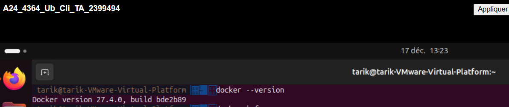
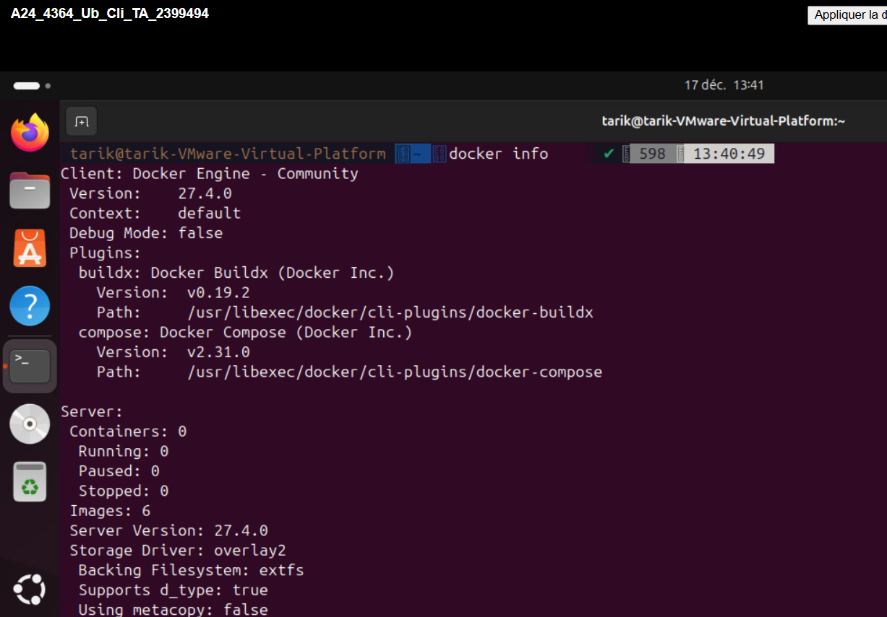
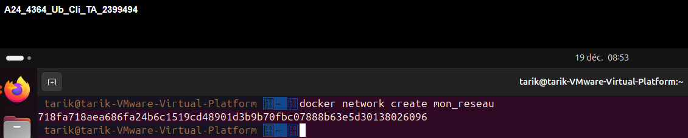
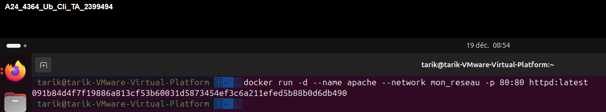
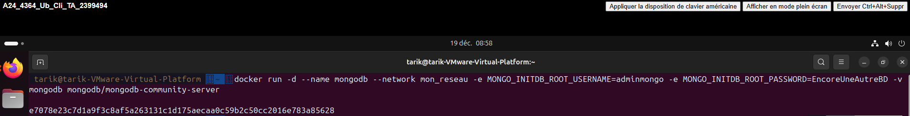
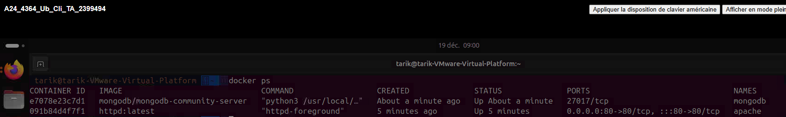

docker #### Nom du projet : 

#### Nom : Ait Oumasste  Tarik 

#### Date : 17-12-2024

#### Description du projet : 

## Section 1 : Vérification et conteneurs
## Étape 1: Vérification de l’installation
### Vérification de l'installation de Docker

Deux composantes ont été installées avec Docker :  
1. Docker Engine  
2. Docker Client

#### Les commandes de vérification

- Pour Docker client :
   ```
   docker --version
   ``` 
 


- Pour Docker Engine :
   ```
   docker info
   ```
 

## Étape 2: Création de conteneurs sur le poste local
#### Les commandes réalisées :

- Créer le réseau privé virtuel :

```
docker network create mon_reseau
```



- Lancer le conteneur Apache :
```
docker run -d --name apache --network mon_reseau -p 80:80 httpd:latest
```



- Lancer le conteneur MongoDB :
```
docker run -d --name mongodb --network mon_reseau -e MONGO_INITDB_ROOT_USERNAME=adminmongo MONGO_INITDB_ROOT_PASSWORD=EncoreUneAutreBD -v mongodb mongodb/mongodb-community-server
```



- Vérifier la présence des conteneurs :
```
docker ps
```



- Vérifier que les conteneurs sont bien reliés au réseau privé virtuel ```mon_reseau``` :
```
docker inspect apache mongodb  
```

-Vérifier les journaux apache :
```
docker logs apache
```
résultat :
```
AH00558: httpd: Could not reliably determine the server's fully qualified domain name, using 172.18.0.2. Set the 'ServerName' directive globally to suppress this message
AH00558: httpd: Could not reliably determine the server's fully qualified domain name, using 172.18.0.2. Set the 'ServerName' directive globally to suppress this message
[Tue Dec 17 18:52:38.950560 2024] [mpm_event:notice] [pid 1:tid 1] AH00489: Apache/2.4.62 (Unix) configured -- resuming normal operations
[Tue Dec 17 18:52:38.956497 2024] [core:notice] [pid 1:tid 1] AH00094: Command line: 'httpd -D FOREGROUND'
```

