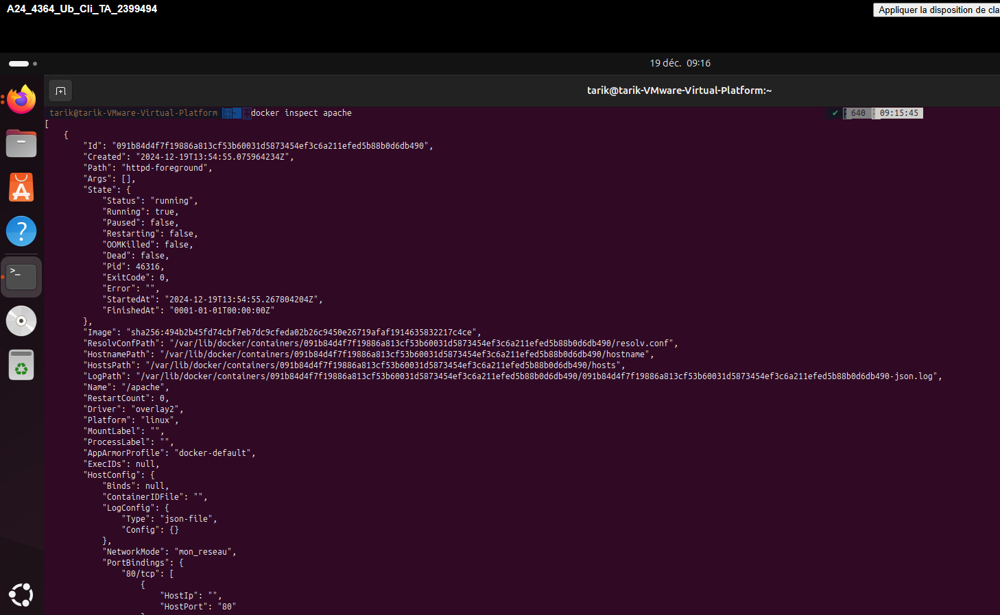
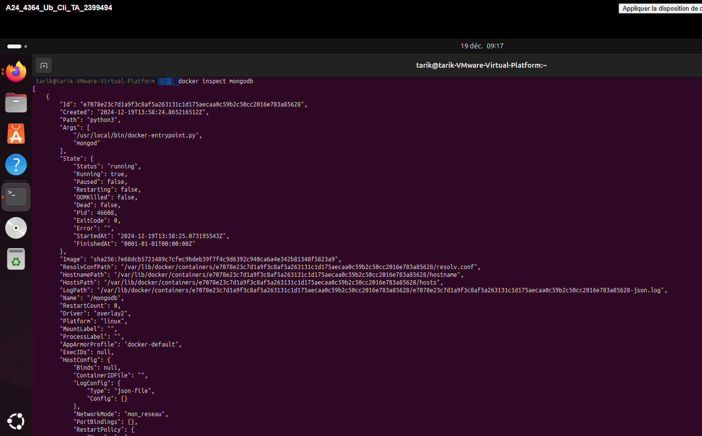
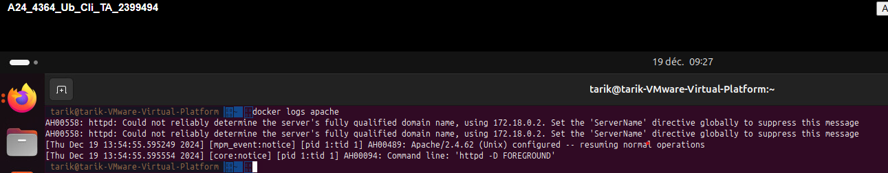
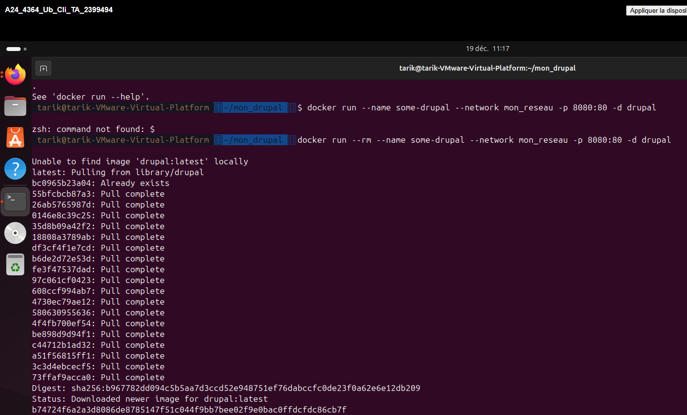
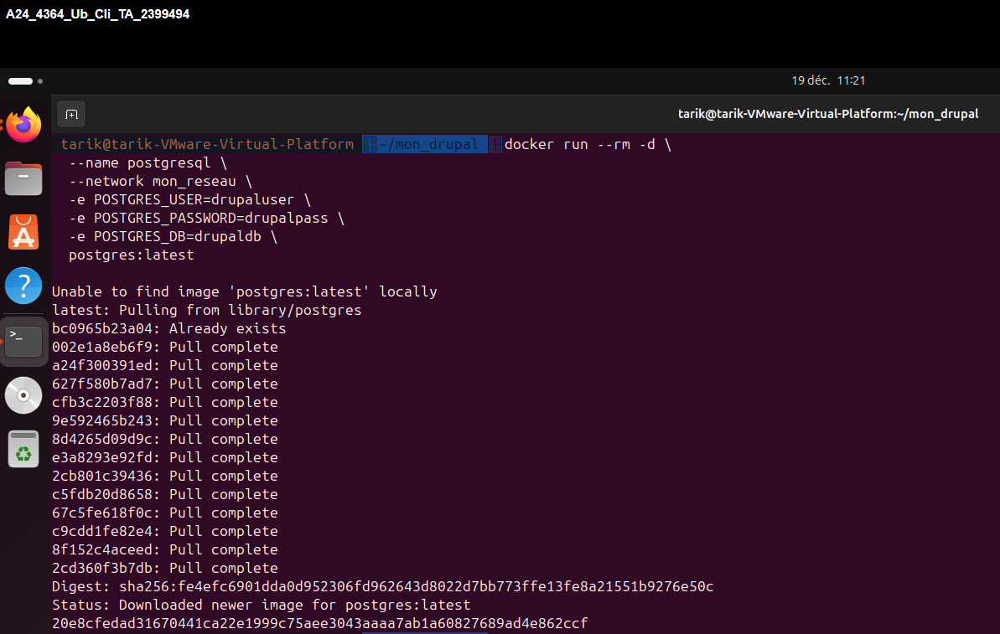

# Travail pratique 2 - Docker

## Nom du projet : Travail pratique 2 - Docker
### Nom : Ait Oumasste Tarik
### Date : 17-12-2024

### Description du projet
Ce travail pratique a pour objectif de démontrer l'installation, la configuration et l'utilisation de Docker pour créer et gérer des conteneurs.  
Dans le cadre de ce projet, nous allons configurer un réseau virtuel, déployer des services comme Apache et MongoDB dans des conteneurs, et créer une image personnalisée de Drupal avec PostgreSQL.  
Le projet inclut également la vérification du bon fonctionnement des conteneurs et l'application de règles de gestion sécuritaire pour les connexions réseau.

---

## Section 1 : Vérification et conteneurs

### Étape 1 : Vérification de l’installation

#### Vérification de l'installation de Docker
Deux composantes ont été installées avec Docker :  
1. Docker Engine  
2. Docker Client

#### Les commandes de création du réseau virtuel et des conteneurs, et de vérification de leur état :

- Pour Docker Client :
  ```bash
  docker --version
   ``` 
Résultat de la commande :
 


- Pour Docker Engine :
   ```
   docker info
   ```
Résultat de la commande :
 

## Étape 2: Création de conteneurs sur le poste local
#### Les commandes réalisées et leurs résultats:

- Créer le réseau privé virtuel :

```
docker network create mon_reseau
```
Résultat de la commande :


- Lancer le conteneur Apache :
```
docker run -d --name apache --network mon_reseau -p 80:80 httpd:latest
```
Résultat de la commande :


- Lancer le conteneur MongoDB :
```
docker run -d --name mongodb --network mon_reseau -e MONGO_INITDB_ROOT_USERNAME=adminmongo MONGO_INITDB_ROOT_PASSWORD=EncoreUneAutreBD -v mongodb mongodb/mongodb-community-server
```
Résultat de la commande :


- Vérifier la présence des conteneurs :
```
docker ps
```
Résultat de la commande :


- Vérifier que les conteneurs sont bien reliés au réseau privé virtuel ```mon_reseau``` :
```
docker inspect apache 
```
Résultat de la commande :



```
docker inspect mongodb 
```
Résultat de la commande :



- Vérifier les journaux apache :
```
docker logs apache
```
Résultat de la commande :



- Lancer les conteneurs Drupal et PostgreSQL
``` 
docker run --rm --name some-drupal --network mon_reseau -p 8080:80 -d drupal
```
Résultat de la commande :


```
docker run --rm -d --name postgresql --network mon_reseau -e POSTGRES_USER=drupaluser -e POSTGRES_PASSWORD=drupalpass -e POSTGRES_DB=drupaldb postgres:latest
```
Résultat de la commande :

